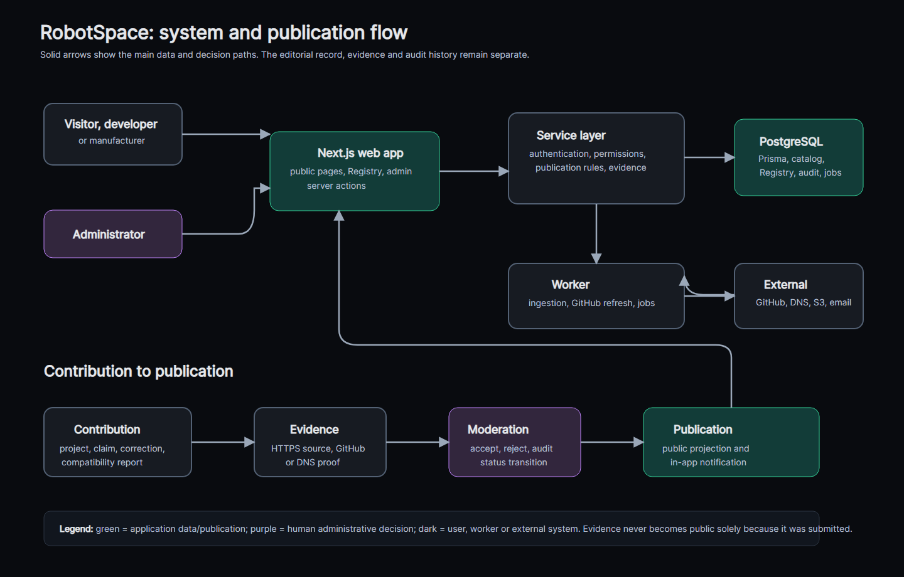

# RobotSpace developer guide

This is the operating guide for the RobotSpace application. It describes the
current repository and production behaviour, not a generic target architecture.
Keep it updated when a user process, permission rule, data model or deploy
procedure changes. The public counterpart is [`/faq`](/faq); update both when a
visitor-facing process changes.

## 1. System at a glance



The editable diagram source is [`robotspace-system.mmd`](robotspace-system.mmd).
The browser-friendly export is [`robotspace-system.svg`](robotspace-system.svg).

Legend and text alternative:

- green boxes are application data and publication steps;
- purple boxes are human administrative decisions;
- dark boxes are people, background work and external systems;
- a contribution carries evidence to moderation; only an accepted decision can
  update public projections or create a contributor notification.

The app is a pnpm workspace:

| Area | Responsibility |
| --- | --- |
| `apps/web` | Next.js 16 public pages, Registry, server actions, Auth.js and administration. |
| `apps/worker` | Scheduled ingestion, source processing, GitHub project refresh and operational jobs. |
| `packages/db` | Prisma schema, SQL migrations, generated client, Registry repositories and integration tests. |
| `packages/domain` | Pure domain rules such as confidence and publication behaviour. |
| `packages/ingestion` | Source adapters and contracts. |
| `packages/ai` | AI provider routing, prompts, SSRF protection and encrypted integration credentials. |
| `packages/observability` | Notifications, logs and operational helpers. |
| `packages/ui` | Shared visual components and theme styles. |

Apps may depend on packages. Packages must not depend on apps. The package
directions are documented in [ADR-001](../adr/ADR-001-monorepo-packages.md).

## 2. Local setup and safe commands

Use Node 24.18+ (24.x) and pnpm 10.15. Do not commit an environment file.

```bash
pnpm install
pnpm --filter @robotspace/db db:generate
pnpm --filter @robotspace/db db:migrate
pnpm --filter @robotspace/app dev
```

Before a web change is handed off, run the checks that match the change:

```bash
pnpm --filter @robotspace/app lint
pnpm --filter @robotspace/app build
pnpm security:secrets
```

For Registry schema, permissions or workflow changes also run:

```bash
pnpm --filter @robotspace/db test:registry
```

Registry fixtures must never run in production. The test suite rejects that
environment. Check generated changes with `git diff --check`, stage files by
name and never add a whole dirty working tree.

## 3. Data model and publication boundaries

`entities` is the stable identity layer. Public robot and company pages read
their public projections. Registry software uses existing `software_packages`
and `software_releases`; it is not a disposable parallel catalog. A Project is
an entity with a stable slug and a software package record. `compatibility_claims`
is the versioned Project-to-Robot relationship.

Registry additions include public users, external GitHub accounts, developer
profiles, entity claims, claim proofs, evidence links, corrections,
compatibility confirmations, repository metric snapshots, notifications and an
append-only reputation ledger. Sources, field assertions and evidence origins
remain the provenance layer for editorial catalog facts.

The important boundary is deliberate:

- catalog/editorial facts are not manufacturer statements;
- official manufacturer material is not automatically an independent test;
- community experience is not an editorial verification;
- a submitted URL is evidence to review, not publication authority.

Public pages show only the combinations allowed by the corresponding
publication query. For example, a compatible project needs a verified
compatibility, a published project entity and a verified software package.
Read [`registry/robot-ecosystem.md`](../registry/robot-ecosystem.md) before
changing that query.

## 4. Registry workflows and status lifecycles

### Project import and ownership

1. A GitHub-signed-in user imports a public repository at `/projects/new`.
2. The project starts as a draft/discovered record. Import is not ownership.
3. `/claim?project=<slug>` requests a fresh GitHub session and checks the
   expected public repository and `permissions.admin`.
4. A verified claim grants project management and eligibility to create a
   developer profile. A user may revoke their own claim.
5. Missing organisation permission information can leave a claim pending for
   review. Do not treat a pending claim as verified.

The precise OAuth scope, short-lived encrypted grant and revoke behaviour are
in [`registry/github-claims.md`](../registry/github-claims.md). Keep GitHub
tokens server-only and short-lived; never add them to a browser session, log or
database query result.

### Project metadata and compatibility

Verified owners can edit allowed draft metadata. Changes to published metadata
become a correction proposal with evidence. A compatibility suggestion requires
a claimed project, a published robot and credential-free HTTPS evidence. It is
pending until moderation accepts or rejects it.

An independent signed-in user may submit one `CONFIRMED` or `DISPUTED` report
for an already verified compatibility. Owners and the original author cannot
provide an independent report about the same relationship. Accepted reports
remain separate and a dispute never deletes confirmations. The complete rules
and reputation ledger are in
[`registry/community-trust.md`](../registry/community-trust.md).

### Manufacturer voice

A company must already be published and have an editor-verified official HTTPS
website. A GitHub-signed-in claimant receives a 48-hour DNS TXT challenge at
`_robotspace.<verified-hostname>`. A matching record changes the claim to
`VERIFIED` and grants `VERIFIED_MANUFACTURER`, not administrator rights.

The manufacturer can publish a statement within existing `MANUFACTURES`
relationships only. Statements require evidence on the verified company domain
and are append-only. Revoking access removes the current badge and publishing
right but preserves history. See
[`registry/manufacturer-voice.md`](../registry/manufacturer-voice.md).

### Status and audit rules

Use the database guards and service functions rather than direct status SQL.
Transition rules, immutable compatibility scope and evidence requirements are
designed to keep the audit chain meaningful. `registry_changes`, audit logs,
immutable confirmation records and reputation events preserve the story of a
decision. A correction is normally a new record, not an edit of an immutable
published source.

Feature flags are stored per environment. `registry.read`, `registry.write`,
`registry.claims` and `registry.sync` must be enabled deliberately. A disabled
flag is not a reason to bypass service checks or manually publish unverified
records.

## 5. Authentication and permissions

Auth.js supports two distinct session kinds:

- the administrator uses `ADMIN_PASSWORD` and admin routes;
- a public Registry contributor signs in with GitHub and receives a Registry
  user identity.

Do not merge these identities. Registry mutations require an active Registry
account and the matching feature flag. Project management additionally requires
a verified entity claim. Manufacturer publishing additionally requires a
verified manufacturer claim. Administration remains deny-by-default and uses
the existing admin middleware/layout.

GitHub OAuth provider variables are `GITHUB_CLIENT_ID` and
`GITHUB_CLIENT_SECRET`; `AUTH_SECRET` signs sessions and protects short-lived
grants. The GitHub callback is `/api/auth/callback/github`. Use a separate OAuth
application for local development when its callback differs from production.

## 6. Worker, jobs and integrations

The worker shares PostgreSQL with the web app. Scheduled ingestion and Registry
GitHub sync write durable observations and jobs; public pages read the latest
successful snapshot so an external outage does not erase prior verified data.
`registry-github-sync` is feature-gated, checks a small bounded batch and keeps
failure statuses such as rate limiting visible to operations. See
[`registry/github-sync-ranking.md`](../registry/github-sync-ranking.md).

The project uses a PostgreSQL-backed job queue to avoid a Redis service on the
small VPS. Jobs must be idempotent, lease-safe and bounded in concurrency. See
[ADR-002](../adr/ADR-002-postgresql-job-queue.md) before changing queue work.

External input is hostile by default. Preserve SSRF controls, URL validation,
HTTPS-only evidence rules and size limits. `robotspace.yaml` is a proposal
format, not proof of ownership or compatibility. Its v1 contract is
[`registry/robotspace-yaml-v1.md`](../registry/robotspace-yaml-v1.md).

## 7. Environment variables

Names below are documented for operations only. Store values in untracked local
environment files or the production shared environment file. Never put values,
tokens, passwords, connection strings or encrypted keyrings in documentation,
issues, logs or client bundles.

| Variable | Purpose |
| --- | --- |
| `DATABASE_URL`, `DIRECT_DATABASE_URL` | Prisma/application connection and optional direct migration connection. |
| `AUTH_SECRET`, `NEXTAUTH_SECRET` | Auth.js session and grant protection; keep stable across releases. |
| `GITHUB_CLIENT_ID`, `GITHUB_CLIENT_SECRET` | GitHub Registry OAuth identity and secret. |
| `ADMIN_PASSWORD`, `BOOTSTRAP_ADMIN_EMAIL` | Administrator access/bootstrap identity. |
| `NEXT_PUBLIC_SITE_URL`, `APP_BASE_URL` | Public canonical/application base URL. Only deliberately public values may use `NEXT_PUBLIC_`. |
| `S3_ENDPOINT`, `S3_REGION`, `S3_BUCKET`, `S3_ACCESS_KEY_ID`, `S3_SECRET_ACCESS_KEY`, `S3_PUBLIC_BASE_URL` | Object storage and public asset base. |
| `EMAIL_TRANSPORT_URL`, `SMTP_EMAIL` | Operational and contributor email transport/recipient. |
| `INTEGRATION_CREDENTIALS_ACTIVE_KEY_ID`, `INTEGRATION_CREDENTIALS_KEYRING` | Key selection and encrypted integration credentials. |
| `UN_COMTRADE_API_KEY` | Source-specific Comtrade access. |
| `INTERNAL_AGENT_TOKEN`, `INTERNAL_AGENT_SUMMARY_URL` | Internal worker-to-web summary authentication and destination. |
| `AGENT_TIMEZONE` | Scheduled-agent timezone. |
| `CAPTCHA_SITE_KEY`, `CAPTCHA_SECRET_KEY` | CAPTCHA client/server configuration. |
| `MAP_STYLE_URL` | Optional map rendering style. |

`NODE_ENV` selects development or production behaviour. `ADMIN_DEV_BYPASS` is
development-only and must not be used to open production administration.

## 8. Migrations, deploy and rollback

All migrations live in `packages/db/migrations/` and must be additive unless an
expand/contract sequence is explicitly planned. Generate Prisma before building
code that uses a new schema, apply the migration before switching web code, and
test the full Registry migration path for Registry work.

Current production is a release-directory deployment, not the older Docker
procedure described in ADR-007 and `deploy/README.md`. The operational source
of truth is:

1. Read the current target and free disk space: `readlink -f /opt/robotspace/current`
   and `df -h`.
2. Create a new release from `current` with `cp -al`; do not modify current.
3. Remove only changed paths plus `.next` and `apps/worker/dist` in the new
   release, then unpack the immutable commit archive there.
4. Before generation, migration and build, load
   `/opt/robotspace/shared/.env.production` with `set -a; . ...; set +a`.
5. Run Prisma generation and required migration, build web and worker, then
   atomically point `current.next` to the new release and replace `current`.
6. Restart `robotspace.service` and `robotspace-worker.service`.
7. Check `http://127.0.0.1:3001/api/health/ready` and the public
   `/api/health/ready`, then smoke the changed route.

Before a migration, preserve a usable database backup. Never delete `current`.
When freeing disk, first confirm the resolved current release and retain current
plus one rollback release. A schema rollback is safe only when the migration's
data-loss conditions allow it; a code rollback after an additive migration is
usually safer than trying to remove new data.

## 9. Diagnostics and change checklist

For a web problem, start with the route, server service state and
`/api/health/ready`. For worker problems, check `robotspace-worker.service`,
the relevant scheduled run and its latest database status. For missing Registry
content, inspect the feature flag and the publication prerequisites before
editing a query. For GitHub data, distinguish a temporary refresh error from a
loss of a verified project or claim.

Before closing any change, ask:

1. Does the visible process still match `/faq`?
2. Does this change alter a permission, status transition, evidence rule or
   audit record? If yes, update this guide and the relevant Registry document.
3. Did an external source, browser-visible page or log receive a secret or
   untrusted URL? If yes, stop and perform a security review.
4. Did the checks cover the web build, Registry test and worker build in
   proportion to the changed area?
